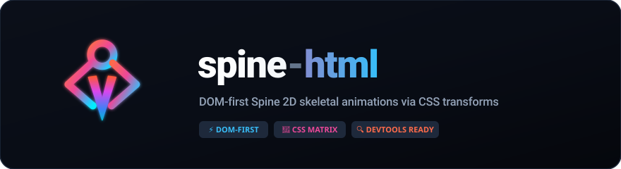

<p align="center">
  
</p>

<p align="center">
  <a href="https://www.npmjs.com/package/spine-html"></a>
  <a href="https://www.npmjs.com/package/spine-html"></a>
  <a href="LICENSE"></a>
</p>

Render [Spine](https://esotericsoftware.com/) skeletal animations as **plain DOM** — one
absolutely-positioned `` per slot, posed with a single CSS `matrix()` write per frame.
No canvas, no WebGL for the rigid tier.

## Why

Every Spine web runtime rasterizes into a canvas. But `spine-core` is fully
renderer-independent: it computes bone world transforms — and even deformed mesh
vertices — on the CPU. For **region attachments** (the rigid parts of a skeleton), a bone
transform is a plain affine map, and CSS `transform: matrix()` expresses that *exactly*.
So the rigid tier of a Spine skeleton can live in the DOM, composited by the browser,
inspectable in devtools, styled with CSS.

The idea has been floated on the official forum three times since 2014 and was never
built — the blockers named were meshes, clipping, and DOM update overhead. This project
is the experiment: how far does the DOM actually go, and how cheap is it?

Measured so far (PoC, Chromium on Apple silicon):

- Rigid only (spineboy-ess): 10 skeletons / 180 slot images at **~0.03 ms skeleton math
  + ~0.22 ms DOM writes per frame** — about 1.5% of a 60 fps frame budget.
- With meshes (spineboy-pro): 1 skeleton = **~0.05 ms + ~0.5 ms render** (8 mesh
  canvases, 323 triangles); 10 running skeletons = **~3.5 ms/frame** total.
- Dirty-skip: 10 *static* skeletons (pose held) = **~0.4 ms/frame** on both Chromium
  and WebKit — unchanged meshes reuse their raster, so idle parts cost nothing.
- Real Safari (on-device, not headless): 10 running skeletons ≈ **4–5 ms/frame**,
  1 skeleton ≈ **0.7 ms**, frozen poses ≈ **0.6 ms** with every mesh reused. The
  ~140 ms/frame seen on *headless* WebKit is its software rasterizer, not a Safari
  property — on-device canvas2d is GPU-accelerated and lands on par with Chromium.

## Status

**Proof of concept.**

- ✅ Region attachments (rigid parts): exact affine mapping, draw-order via `z-index`,
  attachment swaps, alpha
- ✅ Atlas unpacking at load time (90°-packed regions restored), so the rigid per-frame
  path never touches a canvas
- ✅ Mesh attachments (deform tier): small per-part canvases sized to the mesh's world
  bounds, interleaved with the rigid `` slots in one stacking context — the DOM
  handles the bones, a rasterizer handles the warps
- ✅ Blend modes via `mix-blend-mode` (additive = `plus-lighter`)
- ✅ Crack-free mesh seams on clip-antialiasing browsers (Safari): each triangle's
  clip polygon is expanded 0.5px from its centroid so neighbours overlap — the
  texture is continuous across shared edges, so the overlap is invisible
  (`?expand=0` shows the cracks for comparison)
- ✅ RGB tinting (skeleton × slot × attachment color) via an SVG `feColorMatrix`
  reference filter per element — an exact channel multiply that works identically on
  `` and `<canvas>` without touching the raster (needs reference-filter support,
  Safari 15+; verified pixel-level on Chromium and WebKit). Dark/two-color tint is
  not expressible this way and stays out of scope
- ✅ DPR-aware mesh canvas backing store: `renderer.pixelRatio` (defaults to
  `devicePixelRatio`; if you scale the root element, fold that scale in)
- ✅ Dirty-skip: a mesh whose canvas-space vertices didn't change reuses last frame's
  raster — the CSS translate still tracks it, so parts that hold a pose (or move by
  whole pixels) pay zero raster. 10 frozen spineboys: WebKit ~141 → ~0.5 ms/frame
- ⬜ Clipping — deliberately unsupported (counted and skipped); layered transparent
  parts + `overflow: hidden` cover the practical cases
- ✅ WebKit cost resolved by on-device measurement: the "~15× slower per-triangle
  path" observed earlier is a **headless-WebKit artifact** (software rasterization —
  which is also why a 0.4× backing store measured the same as 1× there). Real Safari
  runs 10 continuously-deforming skeletons at ~4–5 ms/frame, on par with Chromium,
  so the once-planned WebGL blit backend is shelved — no real-device workload
  needs it

## Install

```bash
npm i spine-html @esotericsoftware/spine-core
```

```ts
import { TextureAtlas, AtlasAttachmentLoader, SkeletonJson, Skeleton,
  AnimationState, AnimationStateData, Physics } from '@esotericsoftware/spine-core';
import { SpineHtmlRenderer, DomTexture, unpackRegions } from 'spine-html';

// Load: parse the atlas, attach page images, unpack per-region bitmaps once.
const atlas = new TextureAtlas(atlasText);
const pageImages = new Map<string, HTMLImageElement>();
for (const page of atlas.pages) {
  const image = await loadImage(page.name); // your loader
  page.setTexture(new DomTexture(image));
  pageImages.set(page.name, image);
}
const regionImages = await unpackRegions(atlas, pageImages);
const data = new SkeletonJson(new AtlasAttachmentLoader(atlas)).readSkeletonData(jsonText);

// A positioned element becomes the skeleton origin (Spine is Y-up: the
// skeleton grows upward from it).
const skeleton = new Skeleton(data);
const state = new AnimationState(new AnimationStateData(data));
state.setAnimation(0, 'walk', true);
const renderer = new SpineHtmlRenderer(rootElement, regionImages);
// Mesh canvases raster at devicePixelRatio by default; if you scale the
// root element, fold that scale in so the raster matches the screen:
// renderer.pixelRatio = devicePixelRatio * rootScale;

function frame(delta: number) {
  state.update(delta);
  state.apply(skeleton);
  skeleton.update(delta);
  skeleton.updateWorldTransform(Physics.update);
  renderer.render(skeleton);
}
```

`spine-html` is a third-party renderer and is not affiliated with or endorsed by
Esoteric Software.

## Demo (this repository)

```bash
bun install
bun run dev
```

The official spineboy example assets are downloaded automatically on first `dev`/`build`
(they are owned by Esoteric Software and not redistributed in this repository — see
[NOTICE.md](NOTICE.md)); `bun run fetch-assets` runs the same idempotent step manually.

Debug knobs (query string): `?skel=pro|ess` `?anim=walk` `?count=10` pick the scene,
`?tint=ff8080` tints the whole skeleton, `?dpr=2` overrides the mesh-canvas backing
ratio, `?timescale=0` freezes the pose (every mesh should report "reused"), and
`?expand=0` disables the crack-closing clip overdraw.

## How it works

1. `@esotericsoftware/spine-core` loads the skeleton and drives `AnimationState`,
   constraints, and physics — all CPU-side, renderer-agnostic.
2. At load time each atlas region is cut into its own bitmap (rotation restored), one
   blob URL per region.
3. Per frame, for each slot in draw order: `computeWorldVertices` yields the region's
   four corners in world space (order **BL, UL, UR, BR** — note the comments inside
   `computeWorldVertices` are stale). Flip Y (Spine is Y-up), derive the affine from
   three corners, write one `matrix()` string. That's the whole render path.

## License

The code in this repository is MIT licensed.

It depends on the [Spine Runtimes](https://github.com/EsotericSoftware/spine-runtimes)
(`@esotericsoftware/spine-core`), which are licensed under the
[Spine Runtimes License](https://esotericsoftware.com/spine-runtimes-license):
**integrating the Spine Runtimes — including through this project — requires each user
to have their own valid Spine Editor license.** See [NOTICE.md](NOTICE.md).

Example assets (spineboy) are owned by Esoteric Software and are fetched from the
official repository at setup time, not redistributed here.
